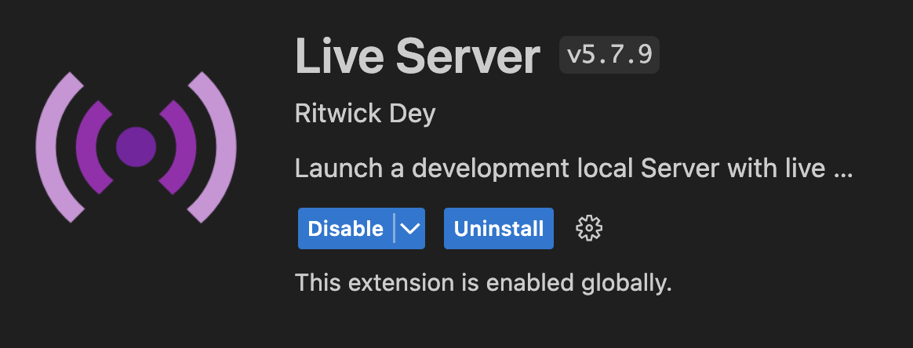
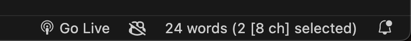

# AI王用クイズスコアカウンター

## 導入 (作成者環境)
- cloneする
- VSCodeで開く
- VSCodeに拡張機能"Live Server"を入れる
  - ritwickdey.liveserver 
  - 
- index.htmlをライブサーバーで開く
  - VSCodeの右下に"Go Live"という文字が出るので、それをクリックすると自動的にブラウザで開かれる
    - 
  - サーバー機能がないとCSVを読み込んでくれない